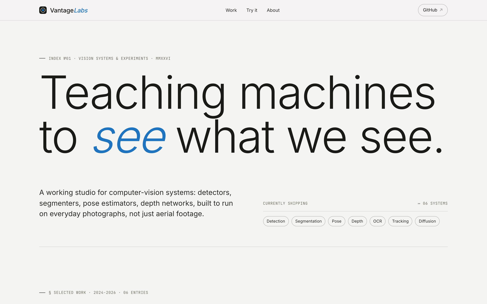

<div align="center">


# VantageLabs

**Computer-vision tools for aerial and video footage that run entirely in your browser.**

[Live site](https://vantage.lodonu.dev/) · [Available tools](#available-tools) · [How it works](#how-it-works) · [Run locally](#run-locally) · [Deploying](#deploying)

[](https://vantage.lodonu.dev/)
[](LICENSE)
[](https://react.dev)
[](https://developers.cloudflare.com/workers/)
[](#about)



</div>

---

## What is VantageLabs?

A focused toolkit for working with drone footage and video files in the browser. Drop a video in, get the frames out. No upload, no server, no account.

The same computer-vision logic ships twice: once as JavaScript that runs on the user's GPU/CPU via the Canvas API, and once as Python under `python/`. The Python sibling powers the standalone CLI and also loads directly into the browser tab via [Pyodide](https://pyodide.org/) — Frame Extractor exposes a JS / Python engine toggle, and the 10 MB Pyodide runtime is fetched lazily only when the user opts in.

## Available tools

| Tool | Description | Status |
| --- | --- | --- |
| **Frame Extractor** | Extract high-resolution stills from any video at a chosen interval | 🟢 Live |
| **Sharpness Scorer** | Auto-rank extracted frames by image quality (Laplacian variance) | 🔜 Soon |
| **Color Segmentation** | Classify aerial imagery into vegetation / water / built areas (HSV thresholds) | 🔜 Soon |
| **Object Detection** | Detect and count objects in aerial footage (YOLOv8 in-browser via ONNX Runtime Web) | 🔜 Soon |
| **Traffic Analysis** | Count and track vehicles from above, with a heatmap visualization | 🔜 Soon |
| **Aerial Mapper** | Stitch overlapping aerial photos into orthomosaic maps | 🔜 Soon |

## How it works

VantageLabs is a **client-only** app. There is no backend we own. When you drop a video in:

1. The browser creates an in-memory `URL.createObjectURL` from the file. No network request, no upload.
2. A hidden `<video>` element decodes the video, and a `<canvas>` paints each frame at full resolution.
3. The canvas encodes each frame as a JPEG `Blob`, all in your tab's memory.
4. JSZip (lazy-loaded only when you click *Download All*) bundles the JPEGs into a ZIP.

For heavier algorithms that don't fit comfortably in JavaScript, the same logic is written in Python under `python/` and will load in the browser via [Pyodide](https://pyodide.org/) (same entry points, same defaults) so the standalone CLI tool and the in-browser tool stay aligned. For models that even Pyodide can't carry (large YOLO weights, mapping pipelines), an optional Hugging Face Inference Endpoint is the only network hop.

## Tech stack

- **React 19 + React Router 7** for UI and routing, with `react-helmet-async` for per-route meta.
- **Canvas API + HTML5 Video** for in-browser frame extraction.
- **JSZip** for client-side ZIP packaging (lazy-loaded chunk).
- **OpenCV (cv2)** for the Python sibling of the in-browser pipeline.
- **Pyodide** runs the Python tools in the same browser tab; lazy-loaded on demand.
- **YOLOv8 / ONNX Runtime Web** *(planned)* for object detection without a server.
- **Cloudflare Workers Assets** for hosting (see [Deploying](#deploying)). SPA fallback handled at the platform level.
- **GitHub Actions** for CI: install, build, prerender, deploy via Wrangler.

## Project structure

```
.
├── public/                    Static assets (favicon, OG image, robots, sitemap, llms.txt)
├── src/
│   ├── components/            Header (with mobile menu), Footer, VideoDropZone,
│   │                          ImageGrid, ImageViewer, ProgressBar, DownloadButton,
│   │                          ToolCard, CVPrimitives (decorative SVGs)
│   ├── pages/                 Home, FrameExtractor, and per-tool placeholders
│   ├── utils/                 videoProcessor, downloadHelper, pyodideLoader
│   ├── App.jsx                Routes + ScrollToTop / hash-link handler
│   ├── index.js               Mount + hydration switch
│   └── styles.css             Global styles, single accent color (Swiss blue)
├── python/
│   ├── frame_extraction/      CLI sibling of utils/videoProcessor.js (OpenCV)
│   └── …/                     One module per tool; one will be wired up at a time
├── notebooks/                 Jupyter notebooks documenting experiments
├── scripts/
│   ├── prerender.js           postbuild SEO snapshot via Puppeteer
│   └── sync-python.js         pre(start|build): copies python/ → public/python/ for Pyodide
├── docs/                      Architecture, setup notes, screenshots
├── worker.js                  Minimal Workers entry; forwards to ASSETS binding
├── wrangler.jsonc             Workers config (assets directory + SPA fallback)
└── .github/workflows/
    └── deploy.yml             Build + prerender + deploy on push to main
```

## Run locally

```bash
git clone git@github.com:Kenny-Rogers/vantage-labs.git
cd vantage-labs
npm install
npm start
```

The app runs at <http://localhost:3000/>. Drop in any MP4, MOV, or WebM up to 500 MB.

To produce a production build (with prerender):

```bash
npm run build
```

Output lands in `build/` with one `index.html` per route, ready for any static host.

## Deploying

The site is hosted on **Cloudflare Workers Assets** at <https://vantage.lodonu.dev>. Workers Assets serves the prerendered HTML and falls back to `index.html` for unknown routes (SPA mode), configured in `wrangler.jsonc`.

CI is GitHub Actions (`.github/workflows/deploy.yml`):

1. Checkout, install Node 22 + npm deps.
2. `npm run build` — CRA build → `scripts/prerender.js` snapshots all 7 routes via Puppeteer (ubuntu-latest ships with Chrome's deps).
3. `cloudflare/wrangler-action@v3` (pinned to wrangler 4.87) runs `wrangler deploy`.

Required GitHub repo secrets:

- `CLOUDFLARE_API_TOKEN` — Workers Scripts: Edit + Account Settings: Read.
- `CLOUDFLARE_ACCOUNT_ID`.

Cloudflare's git auto-build is intentionally **disconnected** so GitHub Actions is the single deploy path (the Cloudflare build container lacks the GUI libs Puppeteer needs).

## Python scripts

Each tool under `python/` is a standalone CLI. Frame Extractor is the first one wired up:

```bash
cd python/frame_extraction
pip install opencv-python

# Default: 1 frame per second, written into <video-stem>-frames/
python3 extractor.py path/to/drone-footage.mp4

# Tweak interval / output / quality
python3 extractor.py drone-footage.mp4 --interval 0.5 --output ./stills --quality 90
```

`extract_frames` is also importable as a library; see [python/frame_extraction/README.md](python/frame_extraction/README.md). The same function is what the in-browser Pyodide build will load.

## Roadmap

- [x] **Frame Extractor** — extract high-res stills from any video, in-browser
- [x] **Python sibling** — OpenCV CLI for Frame Extractor
- [x] **Cloudflare Workers Assets** deploy with SPA fallback
- [x] **GitHub Actions** CI: build + prerender + deploy
- [x] **SEO** — per-route prerendered HTML, sitemap, robots, llms.txt, JSON-LD
- [x] **Mobile nav** — hamburger menu, hash-anchor scrolling under sticky header
- [x] **Pyodide integration** — Python tools run in-browser via lazy-loaded runtime
- [ ] **Sharpness Scorer** — auto-rank frames by Laplacian variance
- [ ] **Color Segmentation** — HSV thresholds for vegetation / water / built
- [ ] **Object Detection** — YOLOv8 in-browser via ONNX Runtime Web
- [ ] **Traffic Analysis** — vehicle counting with heatmap overlay
- [ ] **Aerial Mapper** — orthomosaic stitching

## About

Built by **Kenny Rogers** in Accra, Ghana, exploring the intersection of aerial footage and computer vision. Get in touch at [contact@lodonu.dev](mailto:contact@lodonu.dev) or via [lodonu.dev](https://www.lodonu.dev/).

## License

[MIT](LICENSE)
